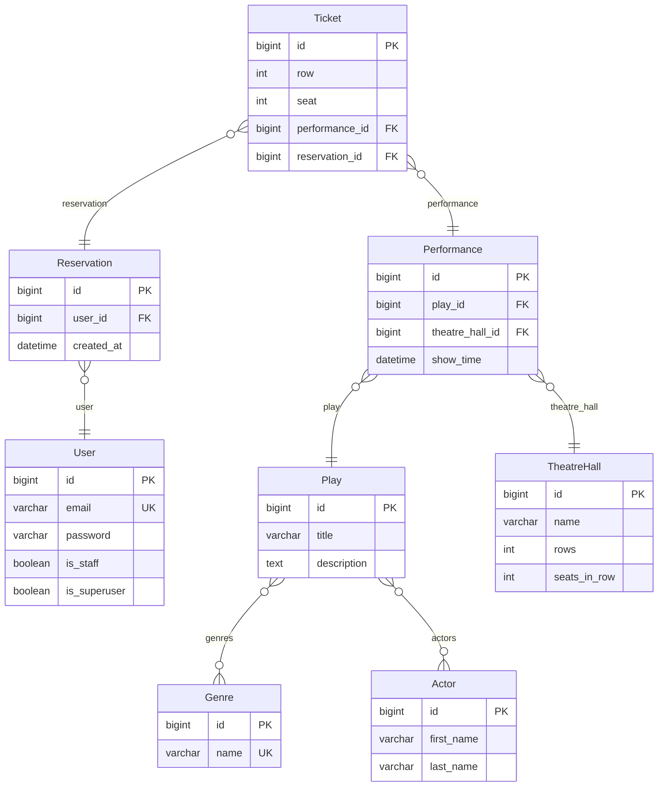

# Theatre API

RESTful backend application for browsing theatrical performances, selecting available seats, and reserving tickets online.

Built with Django REST Framework, JWT authentication, PostgreSQL, and Docker.

## Current Status

**Phase 1 — Project Foundation**:

- Django project scaffold (`theatre_service`)
- Custom email-based User model (no username)
- JWT authentication (register, login, refresh, verify, profile)
- PostgreSQL database configuration via environment variables
- API documentation with drf-spectacular (Swagger UI + ReDoc)
- Docker + Docker Compose setup
- `wait_for_db` management command
- Flake8 linting with plugins

**Phase 2 — Theatre Content Management**:

- Genre, Actor, Play, TheatreHall models with full CRUD
- Serializer hierarchy (base/list/detail) with action-based switching
- `IsAdminOrReadOnly` permission (anonymous read, admin write)
- Play filtering by title, genre name, actor name
- Admin registration for all models

**Phase 3 — Performance Management**:

- Performance model (play + theatre hall + show time)
- Serializer hierarchy (base/list/detail) for performances
- Filtering by play title, date, theatre hall name
- Pagination (10 per page, max 100)

**Phase 4 — Seat Booking**:

- Reservation and Ticket models with seat validation
- Writable nested serializer (create reservation with tickets in one request)
- Atomic transactions for reservation creation
- Unique constraint on (performance, row, seat) — no double-booking
- Seat availability endpoint (`GET /api/performances/{id}/seats/`)
- Users see only their own reservations; admins see all
- `IsAdminOrOwner` permission class

**Phase 5 — Customer Features**:

- Standalone ticket endpoints (`GET /api/tickets/`, `GET /api/tickets/{id}/`)
- Users see only their own tickets; admins see all
- Enriched seat availability response (rows, seats_in_row, taken seats, available seats)

**Phase 6 — Finalization**:

- TheatreHall validation (rows and seats_in_row must be >= 1)
- `ALLOWED_HOSTS` configurable via `DJANGO_ALLOWED_HOSTS` env var
- Timezone-aware datetimes (`USE_TZ = True`)
- Debug toolbar conditional on `DEBUG` (disabled in production)
- 105 tests across all resources with zero warnings

## Database Schema



## Tech Stack

- Python 3.12
- Django 6.0
- Django REST Framework 3.17
- Simple JWT (token authentication)
- drf-spectacular (OpenAPI / Swagger)
- PostgreSQL 16
- Docker & Docker Compose
- Poetry (dependency management)

## Project Structure

```
py-theatre-api/
├── theatre_service/           # Django project config
│   ├── settings.py
│   ├── urls.py
│   ├── wsgi.py
│   └── asgi.py
├── theatre/                   # Core domain app
│   ├── models.py              # Genre, Actor, Play, TheatreHall, Performance, Reservation, Ticket
│   ├── serializers.py         # Base / List / Detail serializers
│   ├── views.py               # ViewSets with filtering, pagination & seat availability
│   ├── urls.py                # DRF router
│   ├── permissions.py         # IsAdminOrReadOnly, IsAdminOrOwner
│   ├── admin.py
│   └── tests/                 # Tests per resource
│       ├── test_genre_api.py
│       ├── test_actor_api.py
│       ├── test_play_api.py
│       ├── test_theatre_hall_api.py
│       ├── test_performance_api.py
│       ├── test_reservation_api.py
│       └── test_ticket_api.py
├── user/                      # Custom user app
│   ├── models.py              # User + UserManager (email-based)
│   ├── serializers.py         # UserSerializer
│   ├── views.py               # Register + profile views
│   ├── urls.py                # Auth endpoints
│   ├── admin.py               # Custom UserAdmin
│   ├── tests.py
│   └── management/
│       └── commands/
│           └── wait_for_db.py
├── Dockerfile
├── docker-compose.yaml
├── pyproject.toml
├── poetry.lock
├── .env.sample
├── .flake8
├── .gitignore
└── .dockerignore
```

## Setup

### Prerequisites

- Docker & Docker Compose **or**
- Python 3.12+ and Poetry 2.x with a running PostgreSQL instance

### Run with Docker (recommended)

```bash
# 1. Clone the repository
git clone <repo-url>
cd py-theatre-api

# 2. Create the environment file
cp .env.sample .env

# 3. Build and start the services
docker-compose up --build

# 4. Create a superuser (in a separate terminal)
docker exec -it theatre python manage.py createsuperuser
```

The API will be available at `http://127.0.0.1:8000/`.

### Run locally (without Docker)

```bash
# 1. Install dependencies
poetry install

# 2. Create the environment file and adjust for local PostgreSQL
cp .env.sample .env
# Edit .env: set POSTGRES_HOST=localhost and your local DB credentials

# 3. Run migrations
poetry run python manage.py migrate

# 4. Create a superuser
poetry run python manage.py createsuperuser

# 5. Start the development server
poetry run python manage.py runserver
```

## Environment Variables

| Variable | Description | Default |
|---|---|---|
| `POSTGRES_DB` | Database name | `theatre` |
| `POSTGRES_USER` | Database user | `theatre` |
| `POSTGRES_PASSWORD` | Database password | `theatre` |
| `POSTGRES_HOST` | Database host | `localhost` |
| `POSTGRES_PORT` | Database port | `5432` |
| `DJANGO_SECRET_KEY` | Django secret key | insecure dev key |
| `DJANGO_DEBUG` | Debug mode (`False` to disable) | `True` |
| `DJANGO_ALLOWED_HOSTS` | Comma-separated allowed hosts | `localhost,127.0.0.1` |

## API Endpoints

### Authentication

| Method | Endpoint | Description |
|---|---|---|
| POST | `/api/users/register/` | Register a new user |
| POST | `/api/users/login/` | Obtain JWT token pair |
| POST | `/api/users/refresh/` | Refresh JWT access token |
| POST | `/api/users/token/verify/` | Verify a JWT token |
| GET | `/api/users/me/` | View / update current user profile |
| PUT | `/api/users/me/` | Update current user profile |

### Genres

| Method | Endpoint | Description |
|---|---|---|
| GET | `/api/genres/` | List all genres |
| GET | `/api/genres/{id}/` | Genre detail |
| POST | `/api/genres/` | Create genre (admin) |
| PUT | `/api/genres/{id}/` | Update genre (admin) |
| DELETE | `/api/genres/{id}/` | Delete genre (admin) |

### Actors

| Method | Endpoint | Description |
|---|---|---|
| GET | `/api/actors/` | List all actors |
| GET | `/api/actors/{id}/` | Actor detail |
| POST | `/api/actors/` | Create actor (admin) |
| PUT | `/api/actors/{id}/` | Update actor (admin) |
| DELETE | `/api/actors/{id}/` | Delete actor (admin) |

### Plays

| Method | Endpoint | Description |
|---|---|---|
| GET | `/api/plays/` | List plays (filterable) |
| GET | `/api/plays/{id}/` | Play detail with genres & actors |
| POST | `/api/plays/` | Create play (admin) |
| PUT | `/api/plays/{id}/` | Update play (admin) |
| DELETE | `/api/plays/{id}/` | Delete play (admin) |

**Filters:** `?title=hamlet`, `?genre=drama`, `?actor=smith`

### Theatre Halls

| Method | Endpoint | Description |
|---|---|---|
| GET | `/api/theatre-halls/` | List all halls |
| GET | `/api/theatre-halls/{id}/` | Hall detail with capacity |
| POST | `/api/theatre-halls/` | Create hall (admin) |
| PUT | `/api/theatre-halls/{id}/` | Update hall (admin) |
| DELETE | `/api/theatre-halls/{id}/` | Delete hall (admin) |

### Performances

| Method | Endpoint | Description |
|---|---|---|
| GET | `/api/performances/` | List performances (paginated, filterable) |
| GET | `/api/performances/{id}/` | Performance detail |
| GET | `/api/performances/{id}/seats/` | Seat map (taken + available) |
| POST | `/api/performances/` | Create performance (admin) |
| PUT | `/api/performances/{id}/` | Update performance (admin) |
| DELETE | `/api/performances/{id}/` | Delete performance (admin) |

**Filters:** `?play=hamlet`, `?date=2026-09-15`, `?hall=grand`

### Reservations

| Method | Endpoint | Description |
|---|---|---|
| GET | `/api/reservations/` | List own reservations (paginated) |
| GET | `/api/reservations/{id}/` | Reservation detail with tickets |
| POST | `/api/reservations/` | Create reservation with tickets |
| DELETE | `/api/reservations/{id}/` | Cancel (delete) reservation |

### Tickets

| Method | Endpoint | Description |
|---|---|---|
| GET | `/api/tickets/` | List own tickets (paginated) |
| GET | `/api/tickets/{id}/` | Ticket detail |

### Documentation

| Method | Endpoint | Description |
|---|---|---|
| GET | `/api/doc/swagger/` | Swagger UI |
| GET | `/api/doc/redoc/` | ReDoc |
| GET | `/api/schema/` | OpenAPI schema (JSON) |

### Admin

| Method | Endpoint | Description |
|---|---|---|
| GET | `/admin/` | Django admin panel |

## Permissions

| Resource | Anonymous | Authenticated | Admin |
|---|---|---|---|
| Genres | Read | Read | Full CRUD |
| Actors | Read | Read | Full CRUD |
| Plays | Read | Read | Full CRUD |
| Theatre Halls | Read | Read | Full CRUD |
| Performances | Read | Read | Full CRUD |
| Seats | Read | Read | Read |
| Reservations | -- | Own only (create, list, detail, delete) | All (list, detail, delete) |
| Tickets | -- | Own only (list, detail) | All (list, detail) |

## Testing

```bash
# Run tests via Docker
docker-compose run theatre sh -c "python manage.py test"

# Run tests locally
poetry run python manage.py test

# Run flake8 linting
poetry run flake8
```
